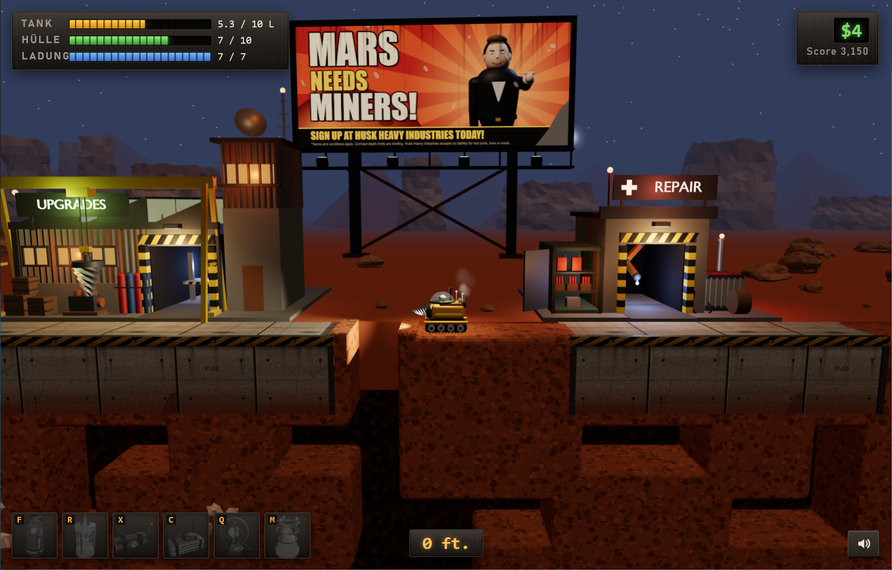

# Core Business

A 2.5D remake of Motherload (XGen Studios) built with three.js. The game mechanics are taken 1:1 from the
ActionScript of the original SWF (physics at 42 fps, world generation, drilling, prices).
Only the presentation is new.

**Play online:** [https://leichtbier.github.io/core-business/](https://leichtbier.github.io/core-business/) Dev mode: append `?dev`.



> [!NOTE]
> **Vibe-coded with Claude Opus 5.5.** The entire work – game code, tests, textures, texts and translations, and all
> 3D models including the Blender scripts that generate them – was vibe-coded with Claude Opus 5.5 (Anthropic).
> Exception: the sounds and music in `assets/sounds/` and `assets/music/` were generated with ElevenLabs.

> [!IMPORTANT]
> **Tech demo, not a product.** Core Business is a non-commercial experiment: it shows how the mechanics of a Flash
> game can be carried over faithfully into a modern 3D presentation in the browser. It is not sold and not offered as
> a finished game; there is no support, no warranty and no promise of further development. Content may be unfinished,
> change at any time or be removed.
>
> **No original assets.** No graphics, models, sounds, music or code from the original game are used. All models are
> generated by the Blender scripts in `assets/`, textures are generated in code, sounds and music were generated with
> ElevenLabs, and the game logic was re-implemented from the original's rules. The original SWF and its ActionScript are not part of this repository.
>
> Fan project, not affiliated with XGen Studios. "Motherload" is a trademark of XGen Studios.

The name: "core business" as in both the company's main line of work and the planet's core – Husk Heavy Industries
lures the miners ever deeper with the promise of the big find, and the real business waits in the core. The storage keys
(`ml3d.*`) keep their old names so existing save games are preserved. In radio message 9 the legendary main vein is
still called "Motherload" – as a nod to the original.

**Run locally:** `Core Business starten.bat` (Windows, local server `server.ps1` on port 8643). Without Windows, any
static web server in the root folder works, e.g. `python -m http.server`; loaded directly via `file://`, the ES modules
won't load.
For testing: `Core Business Testmodus.bat` (test scenarios and test parameters, see below), with starting money
e.g. `"Core Business Testmodus.bat" 1000000`.
The money also applies after "New Game".

## Structure

| File | Contents |
|---|---|
| `src/constants.js` | Values from the original: minerals, upgrades, physics, buildings |
| `src/world.js` | World generation (`generateEarth`), tile collision |
| `src/sim.js` | Game logic: `vehicle.move`, drilling, state changes, shops |
| `src/render.js` | three.js scene: instanced blocks, pod model, lighting by depth |
| `src/ui.js` | HUD and shop interfaces (every action is a button with a fixed `data-nav` key, default selection in `shopDefault()`) |
| `src/nav.js` | Keyboard control of all menus, dialogs and shops: arrow keys/WASD select spatially, Enter/Space triggers, Esc goes back, Tab cycles in order; the topmost visible interface is active |
| `src/touch.js` | Tablet/smartphone controls: analog d-pad at the bottom right (pulse-width modulated per simulation step, so the original key-based logic stays untouched), tap item slots to use them, pause button, space-bar button on the left; shown only in touch mode (on with the first touch, off with the first key press, `?touch` forces it) |
| `style.css` | UI in the style of the game world: brushed sheet metal with rivets, hazard stripes, headings as neon lettering in the sign color of the respective building (`--accent`), numbers as LCD |
| `src/main.js` | Input, fixed 42 Hz loop with interpolated rendering |
| Billboard (`buildBillboard` in `src/render.js`, poster `billboardTexture` in `src/textures.js`) | "MARS NEEDS MINERS!" between the upgrade shop and the repair shop, a good 10 tiles behind the play plane: a Husk Heavy Industries recruitment poster in the style of old propaganda, Mr. Husk pointing at the viewer (rendered from the portrait model at load time, `Portrait3D.snapshotRecruiter`, pose `RECRUITER_POSE`), lit by floodlights at night |
| `test/husk-poses.html` | Trial poses for Mr. Husk on the billboard (which joint axis moves what) |
| `test/finds-view.html` | Preview of the four special-find models from the front and at an angle from above (`?angle=0.6` rotates them) |
| `src/minerals.js` | Special finds as multi-part models with colors per part (bone with vertebra and rib, chest with gold fittings and coins, Martian skull with ribs, crystal in a gold setting with a spiked ring), upright facing the camera. Mineral appearance: a crystal shape per type (ore chunks, nuggets, needles, cubes, rods, prisms, cuts …), colors, glow and a dedicated environment reflection for metallic sheen |
| `src/tiles.js` | Boulders made of 8–10 dented, faceted pieces (core, slabs, shards; 4 variants, `boulderFragments`) that fly apart individually with dynamite/C4, bounce off solid tiles and crumble (`Renderer.breakBoulder`). Tile geometries, tunnel rims (like `Tunnel0..14` in the original) and world-space texturing |
| `test/rim-test.html` | Checks all tunnel rim patterns for correct area |
| `src/audio.js` | Sound (Web Audio): drilling noise from overlapping individual hits, music with crossfading; music and effects have separate volume buses (`setMusicVolume`/`setSfxVolume`, gain = slider²) and mute toggles. The speaker icon bottom right opens the sliders (`setupVolume` in `src/main.js`; Esc or a click elsewhere closes them), key N mutes the music, everything is persisted (`ml3d.volume`) |
| `test/volume-test.html` | Volume: sliders open only on click, music and effects separate, mute toggles, key N, Esc/click outside, persisted after reload |
| `assets/music/main_theme.mp3` | Main theme (loops; quieter in shops without their own track, off while paused) |
| `assets/music/deep_theme.mp3` | Deep theme, replaces the main theme below 6000 ft (the former main theme) |
| `assets/music/fuel_station.mp3` | Fuel station music (starts from the beginning on entering, crossfaded) |
| `assets/music/mineral_processing.mp3` | Mineral processing music (same) |
| `assets/music/upgrade_shop.mp3` | Upgrade shop music (same) |
| `assets/music/repair_shop.mp3` | Repair shop music (same) |
| `assets/pod.py` → `assets/pod.glb` | Pod model, generated by a Blender script |
| `assets/fuel_station.py` → `assets/fuel_station.glb` | Fuel station (industrial, gloomy); `SignGlow` flickers, `Lamp_*` become lights |
| `assets/mineral_processing.py` → `assets/mineral_processing.glb` | Mineral processing (hall, conveyor belt, crusher tower, mine carts) |
| `assets/upgrade_shop.py` → `assets/upgrade_shop.glb` | Upgrade shop (sawtooth roof, overhead crane, tower; `WeldGlow` flickers as welding light) |
| `assets/repair_shop.py` → `assets/repair_shop.glb` | Repair shop (repair arm, item container, generator) |
| `assets/rocks.py` → `assets/rocks.glb` | Rocks and rock formations for the surface (scattered many times in the game) |
| `assets/items.py` → `assets/items.glb`, `assets/items/*.png` | The six items plus one nanobot for the swarm; `--icons` renders the icons for shop and HUD |
| `src/items-fx.js` | Rendering of the items (reserve tank, nanobot swarm, ignition phase and explosions, quantum and matter teleport) and of the pod explosion (fireball, shockwave, debris from the actual pod parts that bounce and burn) |
| `assets/upgrades.py` → `assets/upgrades.glb`, `assets/upgrades/*.png` | All upgrade levels as models and shop icons; visible on the pod: drill head per drill level, paint job (and energy shield) per hull level |
| `assets/dropship.py` → `assets/dropship.glb` | Mothership of the opening sequence (Husk Heavy Industries, MD-07): ducted fans `Fan_0..3`, clamps `Clamp_F/B`, cable `Cable` |
| `src/portrait3d.js` | Radio message portraits rendered live in 3D: `husk` (Mr. Husk in a suit, without combat gear), `husk_battle` (with monocle, staff and Kevlar plates), `satan`, `miner` (olive-green digging pod with pilot) and `static` (noise, optionally with flashing eyes); nods and talks, glowing parts pulse |
| `src/battle.js` | Final battle logic: Mr. Husk (phase 1) and Satan (phase 2), timings and damage from the original, hit zones recreated |
| `src/boss.js` | Final battle rendering: movements via the joints of `husk_boss.glb`, laser, fireball, death and breakout |
| `src/dropship.js` | Opening sequence: approach, lowering on the winch, release in frame 53, departure; hum and release clunk |
| `assets/husk_boss.py` → `assets/husk_boss.glb` | Final boss (final battle and radio portraits): `Husk_P1` Mr. Husk in a Kevlar suit with the Staff of Hell and laser monocle, `Husk_P2` Satan with horns, goat legs, Evil Eyes and the Boiler of Eternal Infernos. Joints as empties (`P1_/P2_` + Hips, Torso, Head, ArmL/R, ForearmL/R, HandL/R, LegL/R, ShinL/R, FootL/R, plus Tail for P2), effect points `P1_LaserOrigin`, `P1_StaffTip`, `P2_BoilerMouth`, `P2_ChimneyL/R` |
| `test/boss-view.html` | Preview of the bosses with trial poses (idle, walk, melee, ranged, fire), checks the joints |
| `assets/bl_helpers.py` | Shared Blender helpers (corrugated metal, hazard stripes, lettering, export, preview) |
| `assets/sounds/drill_1..3.wav` | Drilling sounds (individual hits, ~0.5 s decay) |
| `assets/sounds/engine.wav` | Engine (crossfaded into a seamless loop, pitch/volume by load) |
| `assets/sounds/explosion.wav` | Explosion: pod destroyed, gas pocket, dynamite (higher), C4 (lower) |
| `assets/sounds/fuel_low.wav` | Fuel warning below 15 % every 1.2 s, with an empty tank every 0.5 s until the explosion |
| `assets/sounds/buy.wav` | Cash register: on every successful purchase and sale (SFXpurchase/SFXsale in the original) |
| `test/audio-test.html` | Checks sound loading and scheduling of drill hits |
| `src/i18n.js`, `src/lang/en.js`, `src/lang/de.js` | Languages: English (default) and German, switched on the start screen and stored in the browser (`?lang=de\|en` applies to one visit only). `t(key, …args)` returns the text; static HTML carries its key in `data-i18n`. All player-facing text lives here: menus, HUD, shop titles and messages, names of minerals, upgrades and items, radio messages, find reports and hints. The English names are taken from `src/constants.js` (as in the original); `de.js` must list every key (lists completely) |
| `test/i18n-test.html` | Languages: `de.js` has the same keys as `en.js`, name lists match `src/constants.js`, shops, HUD and shop messages appear in the chosen language |
| `src/save.js` | Save game in the browser (`localStorage`, one slot like the original's SharedObject) |
| `assets/save_pod.py` → `assets/save_pod.glb` | Save pod above the surface (glass dome, hatch `Hatch_L/R` opens on approach, sign `SignGlow`, hover thruster `ThrusterGlow`) |
| `test/save-test.html` | End-to-end: save, overwrite, decline, load (backs up an existing save game and restores it) |
| `test/touch-test.html` | Touch controls: d-pad directions and dead zone, PWM duty cycle and distribution, item slots, pause, space-bar button, tapping through a transmission, touch mode on/off |
| `test/nav-test.html` | Keyboard-only operation: default selection per shop, arrow keys, Enter, Esc, Q/E, pause, start menu |
| `test/sim-test.html` | Headless test of the game logic (result in the DOM) |
| `test/death-test.html` | Checks that death and teleport don't recompile shaders (otherwise the game stutters briefly); the pod lights therefore always stay in the scene |

**Dev mode:** Test scenarios and all test parameters only take effect with `?dev` in the URL (`src/dev.js`; locally via
`Core Business Testmodus.bat`, online by appending `?dev`). Without `?dev` the button is missing and the parameters are ignored.

**Test scenarios:** On the start screen (dev mode only), "TESTSZENARIEN" opens a menu with all scenarios (catalog in
`test/scenarios.js`, logic in `src/menu.js`), plus toggles for test money, all items, maximum upgrades and night.
Return to the start menu via pause (P) or the death screen. `?menu` opens the menu directly.

Test parameters for `index.html` (always together with `?dev`): `?autostart`, `?keys=down,right`, `?warp=N` (pre-simulate N frames), `?zoom=N` (camera distance), `?time=N` (time of day 0..2880, noon 720, midnight 2160), `?scene=pillar|ledge|leak|deep|lava|minerals|upgradeView|repairView` (`minerals` with `&row=N` for the depth) (recreated situations from `test/scenes.js`),
`?checkpoint=N` (storyline checkpoint N: pod placed so that radio message N triggers normally), `?talk=N` (open radio message N immediately, `&portrait=satan` forces a portrait), `?battle=1|2|breakout|win` (final battle directly; with `&bossState=melee|ranged` the boss attacks immediately), `?kill` (destroy the pod immediately), `?nodrop` (skip the opening sequence; test scenarios skip it automatically), `?give=N` (N of every item), `?cash=N`, `?up=drill:6,hull:5` (set upgrade levels), `?shop=fuel|sell|upgrade|repair` (open a shop directly), `?use=I&stopAt=F` (use item I immediately, fast-forward F frames including effects and pause).

## Regenerating models (Blender 5.1)

```
"C:\Program Files\Blender Foundation\Blender 5.1\blender.exe" -b --factory-startup --python assets/pod.py -- --preview pod.png
```

The script builds the pod, exports `assets/pod.glb` and optionally renders a preview image. Parts with fixed
names are animated in the game: `Rotor`, `DrillSide`, `DrillDown`, `Wheel_L0..3`, `Wheel_R0..3`.
If a `.glb` is missing, the game stays on the loading screen and names the missing file.

Items: `assets/items.py -- --icons` builds `items.glb` and renders the icons to `assets/items/`. Each item is an
empty `Item_Fuel`, `Item_Nanobots`, `Item_Dynamite`, `Item_C4`, `Item_Quantum`, `Item_Matter` (plus `Nanobot`);
animated are `Quantum_Ring0..2`, `Matter_Ring0..1`, `Dynamite_Spark` and the materials `BlinkRed`, `FuseSpark`, `FuelGlow`.

## Final battle (as in the original)

The final battle test scenarios (`?checkpoint=12|13`, `?battle=...`) start with a typical loadout for that depth
(`endgameLoadout` in `test/scenes.js`): Diamond Drill, Einsteinium Hull (120 HP, at 85 %), V12, Leviathan Tank (100 L, at 60 %),
Puron Cooling, Titanic Bay with 19 valuable minerals, 1–3 of each item, $38,000. Scenario options take precedence.

Entering the core (below row earthHeight-13) → radio message 12 → battle. Leaving the core (above earthHeight-17)
ends it; on return it starts over.

| | Phase 1: Mr. Husk | Phase 2: Satan |
|---|---|---|
| HP | 1000 × level | 2000 × level |
| Walking | 4 px/frame, looks for the pod every 80 frames | 4 px/frame, every 15 frames |
| Attack | randomly every 80–120 frames: | |
| Melee | Staff of Hell, 100 damage, flings upward (56 frames) | Punch, 200 damage (114 frames) |
| Ranged | Laser monocle, 50 damage, sweeps for 35 frames (75 frames) | Fireball, 100 damage, bounces for 120 frames (89 frames) |
| Contact | 25 damage (every 16 frames) | 50 damage |
| Death | 142 frames, then a 60-frame pause | 369 frames, then victory |

Damage to the pod × cooling × level. Dynamite: 120 directly at the boss, 60 nearby; C4: 240 / 120 / 60 in three zones (on detonation).
Between the phases Satan breaks out of the ground in 219 frames, followed by radio message 13.
Victory: one piece of loot every 60 frames ($28,650,000 in total), then a new round at level+1 (upgrades, items, cargo bay
reset; minerals are worth 1/level; money is kept).

Not derivable from the original and therefore recreated: the hit zones (collision graphics there, rectangles matching
the models here) and the call to `startBattle`/`startBattleP2` (here after closing radio message 12 or 13 respectively).

## Earthquakes (as in the original)

When leaving a shop, there is a 1-in-20 chance of an earthquake once the score is above 150,000 (`earthQuakeChance`; the score
drops to 0 on saving). Every row from row 11 to `earthHeight − 16` then shifts by exactly one tile to the left
or right (random per row, wrapping at the edge, including tile rotation): straight shafts become zigzags, minerals,
lava and gas pockets move along. The surface and the core are unaffected. The strength is always 4 (`random(5 − 4)` is always 0,
so every row shifts). Afterwards the game pauses for 160 frames while the ground shakes (`quakeFX`: 2 frames
offset, 2 frames back, amplitude in 0.5 px steps up to 10 px and back again); the pod stays still.
The rumble is new (silent in the original). It is foreshadowed in radio message 2; the miner in radio message 8 is its victim.
Testing: scenario "Erdbeben" (`?scene=shaft&quake`: straight shaft, then an immediate quake) or `?quake`.

## Special finds

Dinosaur Bones ($1,000), Treasure ($5,000), Martian Skeleton ($10,000) and Religious Artifact ($50,000) only appear below
row 80. As in the original they don't go into the cargo bay; the money is credited immediately. Additionally (not in the original, which only
shows "Wow!"), a find report opens in the style of the radio messages: the find rotates on a turntable, accompanied by a text from the
on-board computer (`finds` in `src/lang/*.js`) and the credit. The game pauses until a key closes it.
Testing: scenario "Mineralien & Sonderfunde" (`?scene=finds`: all ten minerals and four finds in one row) or
`?find=N` (open find report N = 10..13 immediately).

## "Drill blocked" hint

On the first attempt to drill into rock (tile 25..27), a hint from the on-board computer appears once in the radio message window
(orange, boulder on the turntable): rock can't be mined with any drill; that explosives help is only
hinted at ("you'd just have to apply a little pressure"), the player is meant to figure it out. Not in the original. It appears once per game (also across new rounds, not stored in the save game).
Text in `notices` (`src/lang/*.js`). Testing: scenario "Erster Fels" (`?scene=boulders`, drill to the left) or `?notice=rock`.

## Operating the interfaces (keyboard only)

All menus, dialogs and shops can be used without a mouse: <kbd>←↑→↓</kbd>/<kbd>WASD</kbd> select, <kbd>Enter</kbd>/<kbd>Space</kbd>
confirm, <kbd>Esc</kbd> goes back or leaves the shop. The most obvious action is preselected:

| Interface | Preselected | Afterwards |
|---|---|---|
| Start screen | "Continue game" if a save exists, otherwise "Start game" (<kbd>L</kbd> loads directly) | |
| Fuel station | "Fill up" (if less than 1 L is missing: "Leave") | "Leave" |
| Mineral processing | "Sell all" (empty cargo bay: "Leave") | "Leave" |
| Repair shop | "Full repair" if damaged, otherwise the first affordable item | "Leave" after repairing; items stay selected (buy several) |
| Upgrades | the next level of the category; <kbd>Q</kbd>/<kbd>E</kbd> switch category | the following level |
| Pause (<kbd>P</kbd>) | "Resume" | |
| Pod destroyed | "Load last save" if available, otherwise "New game" | |
| Save pod | "Yes, save" (<kbd>J</kbd> yes, <kbd>N</kbd> no) | "Continue" |

## Tablets and smartphones

On touch devices an analog d-pad appears at the bottom right. Left, right and up are dosed by how far the finger is
from the center: the game logic only knows pressed/not pressed (as in the original), so the deflection is turned into
a duty cycle and, per simulation step (42 Hz), into a finely spread key pattern (sigma-delta modulation). At 30 % the
direction is pressed in 30 % of the steps; speed and fuel consumption average out as when tapping a key quickly.
Full thrust from about 85 % of the radius, a dead zone of 22 % per axis in the center (so flying straight up does not
drift sideways), "down" only digs and switches on beyond half the radius. The finger may leave the circle. Tap an item slot
to use the item, the button above the d-pad pauses. The round button on the left edge acts as the space bar (it stays
on top of menus and dialogs, so it confirms the preselected button there). Menus, shops and dialogs are operated by tapping their buttons;
tapping a transmission works like a key press. Landscape is recommended.

## Saving (as in the original)

The save pod hovers above the surface (`savePodMC`, x = 850..923 px, y = −50..48 px, bobs ±5 px over 57 frames).
If the pod flies into it with its center (checked in `tileEvents`, only after `buildingTimer > 15`), the game pauses,
the pod is moved 55 px to the right and stopped, and you are asked whether to save (J/Enter = yes, N/Esc = no).
Saving resets the score to 0 (as in the original) and overwrites the previous save. After a victory you are also asked before the new
round.

The 32 values of `saveGameOffline` are saved: money, level, hull, fuel (at least 1), all upgrade levels,
cargo bay, items, last radio message and play time. World and position are not saved: "SPIEL LADEN" (key L on the
start screen) generates a new world as in the original, the mothership drops off the pod, then the saved values apply.
Test scenario: "Save-Pod" (`?scene=savePod`).

## Items (as in the original)

Bought in the repair shop, used by key. Cooldown: `itemTimer > 5` (counted in `tileEvents`, i.e. every 4 frames).

| Key | Item | Price | Effect |
|---|---|---|---|
| F | Reserve Fuel Tank | $2,000 | +25 L, up to the tank size |
| R | Hull Repair Nanobots | $7,500 | +30 HP, up to the hull maximum |
| X | Dynamite | $2,000 | on the ground only; game pauses 31 frames, then 3×3 tiles around the pod are removed |
| C | Plastic Explosives | $5,000 | on the ground only; game pauses 47 frames, then 5×5 tiles are removed |
| Q | Quantum Teleporter | $2,000 | on the ground only; after 43 frames at x=250, y=1..100 with random momentum, continues after 89 frames |
| M | Matter Transmitter | $10,000 | on the ground only; after 48 frames at rest at (250, 200), continues after 105 frames |

Everything except pavement, buildings and the core area is blown up, including rock, lava and minerals (without credit).
The visuals deliberately differ (ignition phase with sparks or a beeping detonator, a scan for the transmitter), but duration and
effect are exactly those of the original.

## Status

Implemented: opening sequence (10 pre-moves, 53 frames of mothership, as in the original), final battle with loot and a new round, all 14 radio messages (depth thresholds and bonuses as in the original, texts paraphrased; no. 12 on entering the core, no. 13 on Satan's breakout), driving, flying, drilling (down/sideways), fuel, hull, fall damage,
lava, gas pockets, cargo bay, points, special finds, fuel station, mineral processing,
upgrades, repair, death by empty tank/damage, day-night cycle (2880 frames), items, saving and loading (save pod), earthquakes.

Still open: dedicated sounds for teleport, nanobots and reserve tank, inventory (key I, dropping minerals), core music and
dedicated sounds for the final battle (currently explosion sounds and a synthetic laser), final boss.

## GitHub Pages

The game is purely static (no build, three.js lives in `lib/`, all paths relative). To publish:
create the repo on GitHub and push, then under *Settings → Pages* choose "Deploy from a branch", branch `main`, folder `/ (root)`.
`.nojekyll` makes GitHub serve the files unchanged. Save games live in the `localStorage` of
`leichtbier.github.io` and are separate from the local ones (`localhost:8643`).

## Licenses

Code, Blender scripts, 3D models and textures: MIT License (`LICENSE`), with these exceptions:

- **Sounds and music** (`assets/sounds/`, `assets/music/`): generated with ElevenLabs (paid plan). Not covered by the
  MIT License; they may be used only within this project and not extracted or redistributed separately.
- **three.js** (`lib/`): its own MIT License (`lib/LICENSE`).
- **"Motherload"** is a trademark of XGen Studios; the license grants no rights to the name or the original game.
